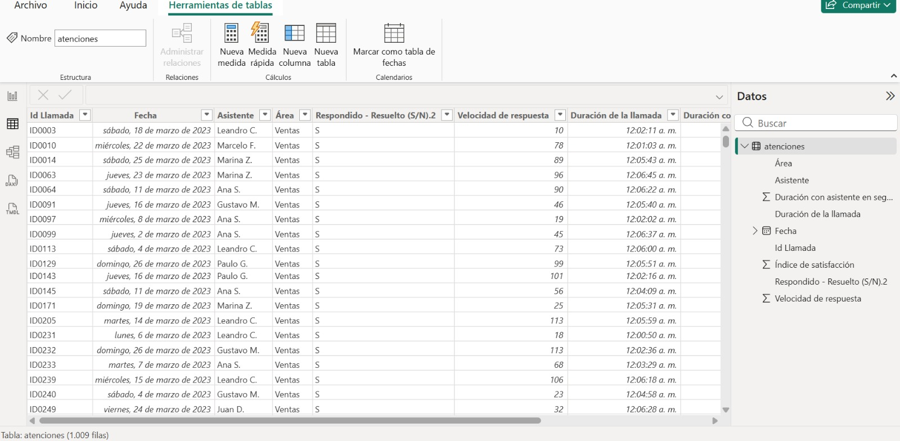
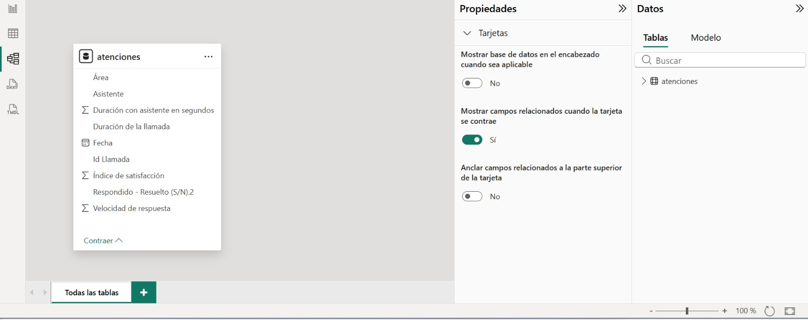

# 📊 Análisis de Servicio al Cliente – Power BI

## Descripción del Proyecto
Este proyecto analiza el rendimiento del servicio al cliente usando Power BI.
El objetivo es identificar patrones en la atención, medir la satisfacción de los 
usuarios y evaluar el desempeño de los asistentes por área.

Este análisis fue desarrollado como parte del evento "Acelerador de Carrera con 
Power BI + IA" organizado por Daxus Latam, simulando el rol de Analista de Datos 
en un centro de atención al cliente.

---

## Preguntas de Negocio
- ¿Cuántas llamadas se gestionaron en total?
- ¿Qué asistente tiene mayor volumen de atención?
- ¿En qué área se concentran más las llamadas?
- ¿Cuál es el índice de satisfacción promedio?
- ¿Qué tan rápido se responden las llamadas?

---

## Conjunto de Datos
Se utilizó una tabla principal llamada **atenciones**:

| Columna | Tipo | Descripción |
|---|---|---|
| Id Llamada | TEXT | Identificador único de la llamada |
| Fecha | DATE | Fecha de la atención |
| Asistente | TEXT | Nombre del asistente |
| Área | TEXT | Área de atención (Ventas, Reclamos, etc.) |
| Respondido - Resuelto | TEXT | Si fue respondida y resuelta (S/N) |
| Velocidad de respuesta | INT | Segundos hasta responder |
| Duración de la llamada | TIME | Duración total de la llamada |
| Índice de satisfacción | FLOAT | Puntuación de satisfacción del cliente |

---

## Panel de Control
panel de control.png.jpeg

## 🗃️ Datos

## 🔗 Modelo de Datos

---

## 📌 Métricas Principales
- Total de llamadas: **1.009**
- Promedio índice de satisfacción: **3.40**
- Promedio velocidad de respuesta: **67 segundos**
- Tasa de resolución: **92.67%**

---

## Etapas del Análisis

| Etapa | Descripción |
|---|---|
| 🧹 Limpieza de datos | Depuración y estandarización en Excel |
| 🔗 Carga en Power BI | Importación y transformación con Power Query |
| 📐 Modelado | Definición de medidas y relaciones |
| 📊 Visualización | Creación del dashboard interactivo |

---

## Técnicas Utilizadas
- Limpieza y transformación de datos en **Excel**
- **Power Query** para preparación de datos
- Medidas con **DAX**
- Visualizaciones: gráfico de dona, barras, mapa de árbol, KPIs

---

## Herramientas
- Microsoft Excel
- Microsoft Power BI Desktop

---

## Autor
**Stiven Lizarazo**  
Analista de Datos Junior  
Proyecto desarrollado como parte del evento **"Acelerador de Carrera con Power BI + IA"**  
organizado por **Daxus Latam** · 19 de marzo de 2026 · 8 horas  
Certificado emitido por: Zaira Hurtado
